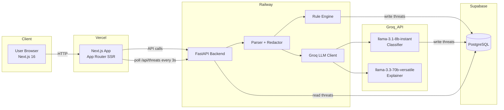
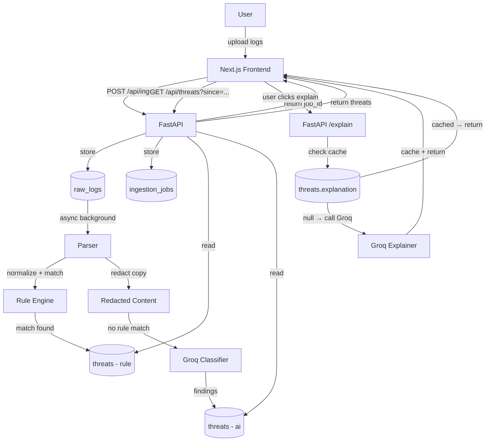
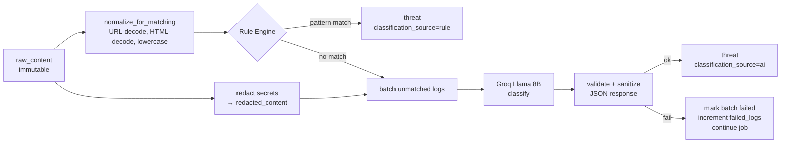
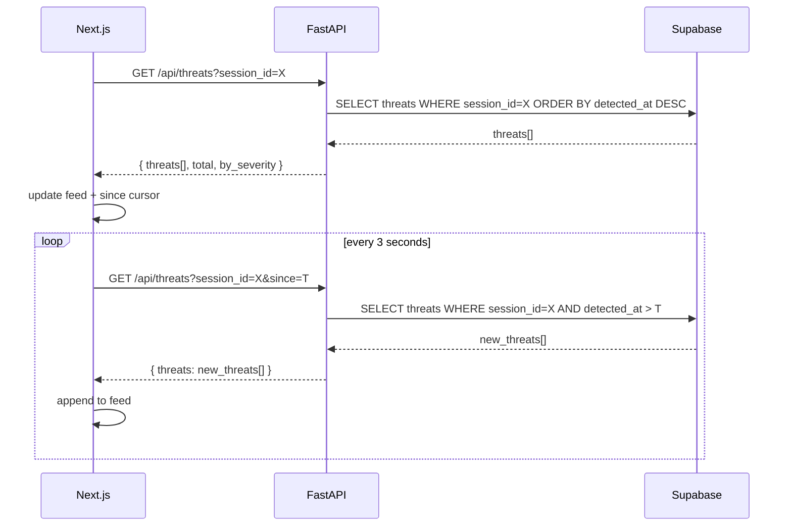
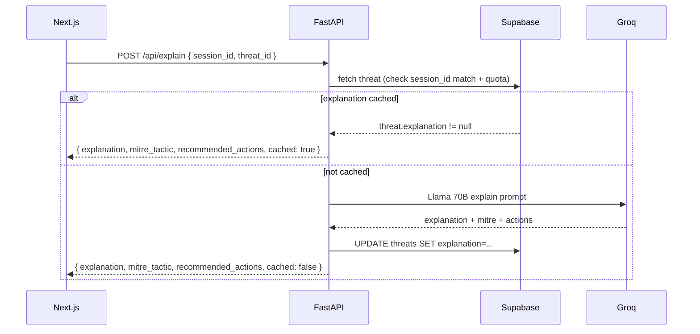

# System Architecture — ThreatLens

## High-Level Component Diagram



---

## Data Flow Diagram



---

## Processing Pipeline (Per Log Batch)



---

## Polling Loop (Frontend)



---

## Explain Flow



---

## Component Responsibilities

| Component | Responsibility |
|-----------|---------------|
| Next.js App Router | Session init, log upload UI, polling loop, threat feed render, explain panel |
| FastAPI | Request validation, async processing orchestration, quota enforcement, CORS |
| Parser | Extract IP, timestamp, username, action from nginx/auth log lines |
| Redactor | Replace secrets in a copy of raw_content before LLM sees it |
| Rule Engine | Pattern + correlation matching on normalized text; writes rule-sourced threats |
| Groq Client | Batch classification + single-threat explanation; JSON validation; semaphore |
| Supabase | Persistent storage; threat/event linking; session lifecycle |

---

## Polling vs Realtime Decision

**MVP uses polling every 3 seconds.**

| Approach | Status | Reason |
|----------|--------|--------|
| Polling (3s) | **Official MVP** | Simple, reliable, no RLS required |
| Supabase Realtime | Post-MVP only | Requires verified session-level RLS before enabling; browser subscriptions must not leak cross-session data |

The `since=ISO_TIMESTAMP` cursor on `/api/threats` makes polling efficient — only new threats are fetched on each tick.

---

## Deployment Topology

```
┌─────────────────────────────────────────────────┐
│  Vercel (free)                                  │
│  ┌────────────────────────────────────────────┐ │
│  │  Next.js 16 App                            │ │
│  │  NEXT_PUBLIC_API_URL = Railway URL         │ │
│  └────────────────────────────────────────────┘ │
└─────────────────────────────────────────────────┘
              │ HTTPS API calls
┌─────────────────────────────────────────────────┐
│  Railway (free)                                 │
│  ┌────────────────────────────────────────────┐ │
│  │  FastAPI (uvicorn)                         │ │
│  │  CORS: FRONTEND_ORIGIN only               │ │
│  │  GROQ_API_KEY (env var)                   │ │
│  │  SUPABASE_SERVICE_ROLE_KEY (env var)      │ │
│  └────────────────────────────────────────────┘ │
└─────────────────────────────────────────────────┘
              │ Supabase client
┌─────────────────────────────────────────────────┐
│  Supabase (free)                                │
│  ┌────────────────────────────────────────────┐ │
│  │  PostgreSQL                                │ │
│  │  service_role_key: backend only           │ │
│  │  anon_key: frontend read-only (future)    │ │
│  └────────────────────────────────────────────┘ │
└─────────────────────────────────────────────────┘
```
