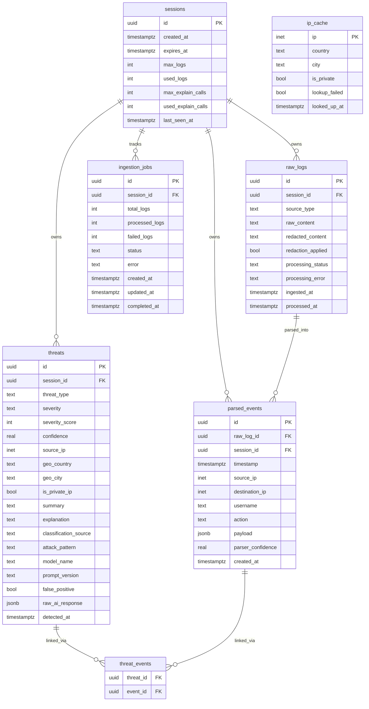

# Entity Relationship Diagram — ThreatLens

## Diagram



---

## Relationships

| From | To | Cardinality | Cascade |
|------|----|-------------|---------|
| sessions | raw_logs | one-to-many | DELETE CASCADE |
| sessions | ingestion_jobs | one-to-many | DELETE CASCADE |
| sessions | parsed_events | one-to-many | DELETE CASCADE |
| sessions | threats | one-to-many | DELETE CASCADE |
| raw_logs | parsed_events | one-to-many | DELETE CASCADE |
| threats | threat_events | one-to-many | DELETE CASCADE |
| parsed_events | threat_events | one-to-many | DELETE CASCADE |
| ip_cache | (none) | standalone lookup table | — |

---

## Key Constraints

### sessions
- `expires_at` defaults to `now() + 24 hours`
- `used_logs` and `used_explain_calls` are incremented atomically in handlers
- Session validation: `now() < expires_at`

### raw_logs
- `raw_content` is **immutable after insert** — no UPDATE ever touches this column
- `processing_status` enum: `queued | processing | processed | failed`
- `source_type` enum: `nginx | auth | syslog | custom`
- Only `processing_status`, `processing_error`, `redacted_content`, `redaction_applied`, `processed_at` update after insert

### ingestion_jobs
- `updated_at` must be set manually on every UPDATE (no trigger)
- `status` enum: `queued | processing | completed | failed`

### parsed_events
- `parser_confidence` range: 0.0–1.0
- `payload` JSONB stores parser-specific fields (HTTP method, path, status code, etc.)
- Private IP check: `source_ip <<= '10.0.0.0/8' OR source_ip <<= '192.168.0.0/16' OR source_ip <<= '172.16.0.0/12'`

### threats
- `severity` enum: `CRITICAL | HIGH | MEDIUM | LOW | INFO`
- `severity_score` range: 1–100
- `confidence` range: 0.0–1.0
- `threat_type` enum: `BRUTE_FORCE | PORT_SCAN | SQLI | XSS | PRIV_ESC | DATA_EXFIL | SSRF | RECON | PATH_TRAVERSAL | MALWARE | SUSPICIOUS`
- `classification_source` enum: `rule | ai | hybrid`
- `explanation` is cached — written once on first `/api/explain` call, never re-fetched unless null

### threat_events
- Composite primary key: `(threat_id, event_id)`
- Links many threats to many parsed_events (a threat can involve multiple log lines)

---

## Indexes

```sql
-- raw_logs
CREATE INDEX idx_raw_logs_status  ON raw_logs(processing_status, ingested_at);
CREATE INDEX idx_raw_logs_session ON raw_logs(session_id);

-- threats
CREATE INDEX idx_threats_session_severity ON threats(session_id, severity_score DESC);
CREATE INDEX idx_threats_session_time     ON threats(session_id, detected_at DESC);

-- threat_events
CREATE INDEX idx_threat_events_event ON threat_events(event_id);
```
